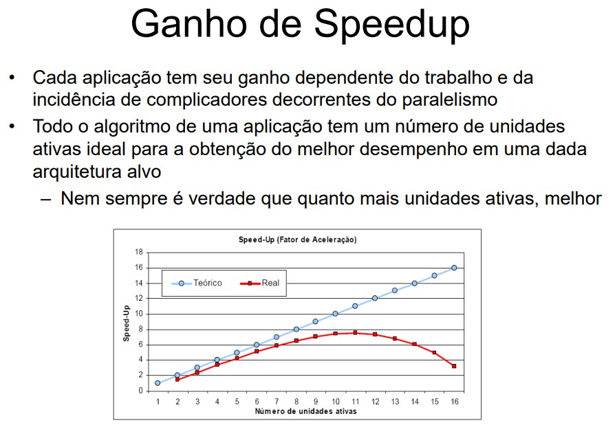

# RISC X CISC

O projeto do Conjunto de Instruções inicia com a escolha de uma entre duas abordagens, a abordagem RISC e a CISC. O termo **RISC** é a abreviação de **Reduced Instruction Set Computer**, ou Computador de Conjunto de Instruções Reduzido e **CISC** vem de **Complex Instruction Set Computer**, ou Computador de Conjunto de Instruções Complexo. Um computador RISC parte do pressuposto de que um conjunto simples de instruções vai resultar numa Unidade de Controle simples, barata e rápida. Já os computadores CISC visam criar arquiteturas complexas o bastante a ponto de facilitar a construção dos compiladores, assim, programas complexos são compilados em programas de máquina mais curtos. Com programas mais curtos, os computadores CISC precisariam acessar menos a memória para buscar instruções e seriam mais rápidos.

* CISC
* Micoroprogramação: Criar novas funções adicionadas diretamente ao hardware, facilitando o trabalho do programador.
* Resultado: Programas com poucas instruções, resultando uma quantidade menor de acessos à memória.
    * Motivações:
        *  Velocidade da memória vs. velocidade da CPU
        *  Densidade do código: Programas com poucas instruções representam menos acessos à memória.
        *  Compatibilidade entre as máquinas: Manter as instruções de modelos anteriores.
        *  Suporte para as linguagens de alto nível: Aproximar a linguagem das novas linguagens de alto nível e reduzir a disparidade semântica.
    * Desvantagens:
        * Processador **sobrecarregado, complexo, maior e mais lento**.

* RISC
	* 85%  do programa consiste em apenas três tipos de instruções: assinalamentos, comandos if e chamadas de procedimentos
	* Desnecessário a inclusão de microprogramas no processador que quase nunca são utilizados.
    * Instruções complexas devem ser incluídas somente quando o benefício no desempenho compensar a degradação de velocidade.
	* O uso de microprogramação deve ser evitado
			§ Aumento significativo da velocidade das memórias resultou na utilização de software em substituição aos microprogramas.
	* O compilador deve substituir eficientemente as operações complexas eliminadas do hardware.
			§ Otimização é fundamental.
    * O projeto de compiladores deve ser realizado juntamente com o projeto dos processadores.
Em suma, RISC é viável graças ao avanço do software.
    * Vantagens:
        * Processador **mais simples, mais rápido e mais barato.**
        * Menor número de circuitos internos, permite clocks mais altos.
        * Qual é o tamanho do código gerado para uma máquina RISC em relação a uma CISC para um determinado programa ?
            * Geralmente possui mais instruções.
            * Potêncialmente para executar de forma mais eficiente, possui instruções mais simples, com operandos inteiros (tempos de busca e execução de cada instrução é muito menor que o o de uma instrução mais complexa)
            * Trechos de instruções mais simples em linguagem de máquina podem ser melhor utilizados pelo compilador (ao invés de instruções complexas que não podem ser decompostas)
    * Desvantagens:
        * Não são boas para cálculo em ponto flutuante sem a ajuda de hardware.

    
* Qual a melhor abordagem ?
Sempre que este assunto é apresentado aos alunos, surge a pergunta crucial sobre qual é a melhor abordagem, a RISC ou a CISC? Esta é uma pergunta difícil e sem resposta definitiva. A melhor resposta que acho é de que depende do uso que se quer fazer do processador.

Processadores RISC geralmente resultam em projetos menores, mais baratos e que consumem menos energia. Isso torna-os muito interessante para dispositivos móveis e computadores portáteis mais simples. Já os processadores CISC trabalham com clock muito elevado, são mais caros e mais poderosos no que diz respeito a desempenho. Entretanto, eles são maiores e consomem mais energia, o que os torna mais indicados para computadores de mesa e notebooks mais poderosos, além de servidores e computadores profissionais.

Os processadores CISC iniciaram com processadores mais simples e depois foram incorporando mais funcionalidades. Os fabricantes, como a Intel e a AMD, precisavam sempre criar novos projetos mas mantendo a compatibilidade com as gerações anteriores. Ou seja, o Conjunto de Instruções executado pelo 486 precisa também ser executado pelo Pentium para os programas continuassem compatíveis. O Pentium IV precisou se manter compatível ao Pentium e o Duo Core é compatível com o Pentium IV. Isso tornou o projeto dos processadores da Intel e AMD muito complexos, mas não pouco eficientes. Os computadores líderes mundiais em competições de desempenho computacional utilizam processadores CISC.

Já o foco dos processadores RISC está na simplicidade e previsibilidade. Além do benefício da previsibilidade do tempo de execução ao Pipeline, ele também é muito interessante para aplicações industriais. Algumas dessas aplicações são chamadas de Aplicações de Tempo Real. Essas aplicações possuem como seu requisito principal o tempo para realizar as tarefas. Assim, o Sistema Operacional precisa saber com quantos milissegundos um programa será executado. Isso só é possível com processadores RISC, com poucos estágios de Pipeline, poucos tipos de instrução, execução em ordem etc. Mesmo que os processadores RISC sejam mais lentos do que os CISC, eles são mais utilizados nessas aplicações críticas e de tempo real, como aplicações industriais, de automação e robótica.

---

# Arquiteturas superescalares
Há duas abordagens típicas atualmente, de forma a melhorar o desempenho:
- Superpipeline
    - É baseado na divisão dos estágios de um pipeline em sub-estágios e, portanto, aumentar o número de instruções que são suportadas pelo pipeline em um dado momento.
    - Divide cada estágio em **dois**, o período de ciclo de clock será reduzido pela metade.
    

    * Cuidados:
        - Conflito de dados
            - Pipeline maior -> mais dependências no pipe -> mais paradas
        - Conflitos de controle
            - Pipeline maior -> mais estágios para preencher -> saltos mais lentos
- Superescalar
    - Em uma arquitetura superescalar, várias instruções podem iniciadas **simultaneamente** e executadas **independentemente** 
    - Incluem todas as características do pipeline mas, além disso, elas podem ter várias instruções executando simultaneamente no mesmo estágio. Eles tem a capacidade de iniciar múltiplas instruções durante o mesmo ciclo do relógio.
    - Consiste de um número de **pipelines** que estão **trabalhando em paralelo**.
    

    - Os limites de execução paralela são muito semelhantes aos que impedem uma execução eficiente em qualquer arquitetura pipeline.    
      

    * Janela de execução
        -  A janela de execução é estendida sobre as bordas dos blocos básicos por previsão de desvio.
            * **Execução especulativa:** 
                -   Com execu
---
# Medidas de desempenho
Desempenho de um computador:

* Tempo de resposta (latência)
    * Quanto tempo leva para meu trabalho ser realizado?
    * Quanto tempo leva para realizar um trabalho específico ?
* Vazão (throughput)
    * Quantos trabalhos a máquina pode realizar em um intervalo de tempo?
    * Qual a velocidade média de execução ?
* Latência x Throughput
    * Se atualizarmos uma máquina com um novo processador, em que melhoramos ?
    * Se acrescentarmos uma máquina ao laboratório, em que melhoramos ?

* CPI (Ciclos por instrução)
    * Número de ciclos por instrução:
        * Específico para cada instrução em uma dada arquitetura;
        * Pode-se contabilizar o número de ciclos médio por instrução como medida de desempenho.
    * Considerando o número de instruções no cálculo de desempenho:
        * Nro de ciclos de relógio = nro de instrucoes * CPI
    *  Como diferentes instruções executam em um número de ciclos de relógio diferentes, a CPI é dada por uma média ponderada das instruções executadas pelo programa.
    * Aplicações com intensas operações de ponto flutuante acarretam em um maior CPI

* MIPS (Milhões de instruções por segundo)
    * Pode ser grande para programas que usam instruções simples.

    * Porque a métrica milhões de instruções por segundo (MIPS) é controversa?
        * A métrica MIPS de uma CPU refere-se a quantas instruções de código de máquina de baixo nível um processador por executar em um segundo. Usar este número como forma de medir o desempenho do processador é completamente **sem sentido**, pois dois chips diferentes não utilizam exatamente os mesmos tipos de instruções, método de execução, etc.. Por exemplo: Em um chip, uma única instrução pode fazer muito pouco, mas é tratada de fomra mais eficiente (RISC). Além disso, diferentes instruções em um mesmo chip CISC podem fazer quantidades muito diferentes de operações (por exemplo, uma instrução aritmética simples pode levar apenas um ciclo de relógio para completar, enquanto fazer algo como divisão de ponto flutuante ou uma operação de raiz pode levar 20 a 50 ciclos de clock.)

* Speedup
    * Limitado pela Lei de Amdahl, que afima que a melhoria de desempenho obtida com o uso de um modo de execução mais rápido é limitada pela fração do tempo que o modo mais rápido pode ser usado:
    

    * Se Speedup > 1, a versão com aprimoramento reduzio o tempo de execução (ficou mais rápida)
    * Se speedup < 1, a versão com aprimoramento aumentou o tempo de execução (ficou mais lenta)

* Outras medidas
    

## Lembrete: Existe MIPS Arquitetura e MIPS medida de desempenho

---

# Memória
O sistema de memória é uma das principais partes do computador, juntamente com o processador. Todos os programas e seus dados são mantidos no sistema de memória e ele é responsável por entregar o mais rapidamente para o processador quando solicitado. Não é uma tarefa simples porque as memórias tendem a ser muito mais lentas do que o processador, e sua tecnologia não tem avançado tão rapidamente quanto a dos processadores
* Hierarquia de memória
    * As tecnologias mais avançadas até o momento são chamadas SRAM (Static Random-Access Memory). Elas são mais utilizadas em registradores e memórias cache. Por serem mais caras estão presentes nos computadores em menores quantidades. Já a memória principal é fabricada utilizando a tecnologia DRAM (Dynamic Randon-Access Memory), por serem menos sofisticadas, são mais baradas que as SRAM. Por isso elas são montadas em maior quantidade do que as memórias cache e os registradores. Já as memórias secudárias são formadas por tecnologias de memórias magnéticas e ópticas (HD). Não são voláteis e seu valor é mais baixo.

* Princípio da localidade
    * Muitos dizem que o sistema de memória se inspirou no sistema de memória do corpo humano, onde lembranças mais recentes são armazenadas em memórias menores de curta duração e lembranças mais antigas e pertinentes são armazenadas em memórias de longa duração e capacidade. No sistema computacional, o sistema de memória se baseia no princípio da localidade, que se divide em temporal e espacial.
    
    
        * **Temporal:** Diz que um dado acessado recentemente tem mais chances de ser usado novamente, do que um dado usado há mais tempo. Isso é verdade por que as variáveis de um programa tendem a ser acessadas várias vezes durante a execução de um programa, e as instruções usam bastante comandos de repetição e sub-programas, o que faz instruções serem acessadas repetidamentes. Sendo assim, o sistema de memória tende a manter os dados e instruções recentemente acessados no topo da hierarquia de memória.
        * **Espacial:** Diz que há uma probabilidade de acesso maior para dados e instruções em endereços próximos àqueles acessados recentemente. Isso também é verdade porque os programas são sequenciais e usam de repetições. Sendo assim, quando uma instrução é acessada, a instrução com maior probabilidade de ser executada em seguida, é a instrução logo a seguir dela. Para variáveis, o princípio é semelhante. Variáveis de um mesmo programa são armazeandas próximas umas às outras, e vetores e matrizes são armazenados em sequência de acordo com seus índices. Baseado neste princípio, o sistema de memória tende a manter dados e instruções próximos aos que estão sendo executados no topo da hierarquia de memória.

    
    
    

## Memória cache
* Definição de **cache**: o lugar seguro para esconder ou guardar algo. É o nome usado para designar o nível de memória entre o procesador e a memória principal.
* Atualmente, cache designa qualquer memória que explore o princípio da localidade (temporal e espacial)

* **Tags** são utilizadas em conjunto com o endereço de mapeamento, de modo a compor o endereço completo da memória principal.

* E como reconhecer se um bloco da cache possui uma informação válida ?
* EX: Quando o processador é inicializado, algo deve sinalizar que a cache está vazia.
* **Solução:** Incluir um **bit de validade**
    * Se o bit de validade for zero, a informação contida naquele bloco da cache não e válida.

    

* Mapeamento associativo: 
    * **Uma linha da memória principal pode residir em qualquer linha da memória cache.**
    * Não há nenhuma relação entre suas localizações;
    * O endereço da linha a ser acessada é comparado com todos os endereços das linhas residentes na memória cache para ver se eal se encontra na memória cache.
        * Quando ocorrer uma falta, a linha é carregada preferencialmente em qualquer linha ainda livre na memória cache;
        * A substituição só se dá se todas as linhas estiverem ocupadas.
        * O mapeamento associativo termina sendo mais eficiente do que o mapeamento direto no momento de alocar blocos da memória na Cache. Só haverá espaço inutilizado se não houver acesso suficiente à Memória Principal. A desvantagem deste tipo de mapeamento está no momento de buscar um bloco na Cache. Imagine agora que alguém chegue no cinema cheio a procura de uma pessoa. Como encontrá-la? Será necessário percorrer todas cadeiras para verificar se a pessoa se encontra em alguma delas. Para o sistema computacional, essa busca é custosa o que resulta na utilização deste mapeamento apenas se a Cache não for grande demais.

* **Escrita na cache:**
    * O esquema Write-through não favorece o desempenho, qualquer escrita faz com que a memória principal também seja escrita. 
        * Como funciona write-through com buffer de escrita:
            1. O buffer de escrita armazena o dado que aguarda para ser escrito na memória;
            2. Após escrever o dado na cache e no buffer de escrita, o processador pode continuar a execução das instruções;
            3. E se o buffer de escrita estiver cheio quando o processador executar uma escrita;
                - O processador precisa para raté que haja espaço no buffer.  
            4. E se a velocidade da memória para completar as escrita for menor que a taxa à qual o processador está gerando as escritas? 
                - Nenhum buffer (por maior que seja) conseguirá resolver o problema.
                - O tamanho do buffer de escrita depende dessa relação.

    * Esquema **write-back**:
        * Quando ocorre uma escrita, o novo valor é escrito apenas no bloco da cache;
        * Tal bloco somente será escrito na memória principal quando ele tiver que ser substituído na cache;
        * O esquema pode aumentar bastante o desempenho, principalmente quando o processador puder gerar escritas tão rapidamente quanto estas puderem ser tratadas pela memória principal.
              
## Memória virtual

* **Memória principal (DRAM)**
    * Tamanho limitado;
    * Tempo de acesso diversas vezes maior que SRAM.
* **Memória secundária (disco magnético)**
    * Grande capacidade de armazenamento;
    * Tempo de latência milhares de vezes maior que DRAM (Ou seja, da ordem de microssegundos ou milissegundos)
    * Pode não ser possível manter um programa inteiro na memória principal, e deseja-se rodar vários programas ao mesmo tempo;
    * **Solução**: manter apenas as partes ativas do(s) programa(s) na memória principal.
    * A memória virtual é uma técnica que dá ao programador a ilusão de poder acessar rapidamente um grande espaço de endereçamento.
    * Seus objetivos:
        * Permitir que haja um meio seguro e eficiente de se compartilhar informações (armazenadas na memória) entre vários programas e minimizar os problemas causados pela existência de uma pequena quantidade de memória principal.

    * A memória virtual gerencia **automaticamente** os dois níveis de hierarquia: **memória principal** (DRAM) e **memória secundária** (disco magnético)

    * **Principais conceitos:** 
        * **Página:** É um blooco de dados de tamanho fixo
        * **Falta de página:** É uma falta no acesso à memória virtual
        * Usando memória virtual: o processador sempre gera um **endereço virtual**, que é traduzido para um endereço real por meio da **MMU** (memory management unit), um sistema **HW+SW**.
        * O edenreço real (também chamado de físico) é, então, usado para acessar a memória.
        

    * **Memória virtual e relocação de código**
    * A técnica de memória virtual simplifica a carga dos programas para execução a partir da relocação.
    * A relocação mapeia os endereços virtuais usados por um determinado programa em endereços físicos (antes de tais endereços serem usados para acessar a memória);
    * A técnica de relocação permite que um programa seja carregado em **qualquer posição da memória principal**;
    * Todos os sistemas de memória virtual relocam os programas por meio de blocos de tamanho fixo, as páginas
    

    * **Projeto de memória virtual**
        * A ocorrência de uma falta de página consome muitos ciclos de relógio;
        * Esse tempo é denominado pelo tempo para obter o primiero endereço de uma página de tamanho típico;
        * A penalidade imensa de uma falta de página conduz a decisões importantes, com uma relação ao projeto de sistemas de memória virtual.
    * Características dos sistemas de memória virtual
        * As páginas devem ser grandes o suficiente para amortizar o tempo de acesso muito grande (geralmente, de 16kb a 64kb)
        * Uma técnica de colocação totalmente associativa tende a proporcionar uma baixa taxa de falta de página;
        * As faltas de página podem ser tratadas por software em função do overhead introduzido ser pequenom quando comparado ao tempo de acesso ao disco;
            * Isso permite o uso de algoritmos mais eficientes para a escolha de como colocar as páginas.
        * Os sistemas de memória virtual usam **write-back**.

    * **Colocação e localização de uma página na memória**
        * Principal objetivo: No projeto de um sistema de memória virtual: redução das faltas de página;
        * Essa redução é obtida por meio do uso de técnicas otimizadas para a colocação das páginas na memória principal;
            * Politica de substituição de blocos mais eficiente;
            * Redução da penalidade das faltas por meio de mais níveis de hierarquia de memória.

    

    

    * **Falta de página**
        * Bit de residênica = 0 indica falta de página
        * Sistema operacional assume o controle, por meio do mecanismo de exceção.
        * O sistema operacional precisa:
            * Encontrar a página faltante no nível hierárquico inferior (geralmente, no HD ou no SSD)
            * Decidir que lugar da memória principal deve ser colocada a página requisitada.
        * O endereço virtual por si só, não informa em que posição do HD está a página que gerou a falta.

        
        

        * **Escrita**
        * A escrita no disco consome milhões de ciclos do relógio
        * O esquema write-back é usado: página é copiada para o disco no momento em que for substituída (nomenclatura: "copy-back")
----

# Arquitetura VLIW

VLIW -> Very Long Instruction Word

Máquinas que exploram paralelismo em nível de instrução, várias operações são executadas em paralelo em diferentes unidades funcionais, tais como em máquinas superescalares.

* A diferença está no controle do despacho e da terminação das operações:
    * **Superescalares:** as depedências são resolvidas em tempo de execução por um hardware dedicado
    * **VLIW:** As dependências são resolvidas pelo compilador em tempo de compilação.

Ex: Intel Itanium
    - EPIC (Explicly Parallel instruction Computing)
    - Até 6 instruções por ciclo
    

- Em uma máquina VLIW, várias operações (instruções em uma máquina normal) são codificadas em uma mesma instrução;
- A palavra de instrução é bastante longa, podendo conter várias operações independentes (que operam sobre operandos);
- A posição de cada operação dentro da palavra VLIW determina a unidade funcional que será usada;
- O hardware de despacho é simples;

Uma comparação sobre como as arquiteturas superescalares X VLIW trabalham 

- A compilaçãode um programa é normalmente feita em três etapas:
    - Parsing da linguagem de entrada para uma descrição (estrutura) intermediária;
    - Otimização da estrutura intermediária;
    - Geração do código para a arquitetura-alvo.
- A estrutura de dados intermediária representa:
    - Fluxo de controle: As diferentes sequências de execução das intruções que forma o programa;
    - Fluxo de dados: As dependências de dados que existem entre várias operações.
- Blocos básicos: Grupos de instruções que são **sempre** executadas em sequência.

## Escalonamento

- O escalonamento das operações consiste em determinar as operações que serão executadas em paralelo;
- Em uma máquina VLIW, o compilador é responsável por esta tarefa (a diferença com arquiteturas superescalares?)
- Operações que são executadas em paralelo são atribuídas à mesma palavra de instrução;
- Em um mesmo bloco básico (sequencial), essas instruções podem ser escalonadas com base no fluxo de dados;
- Escalonamento **ASAP** (as soon as possible);
- A transição da fronteira entre blocos exige técnicas mais elaboradas:
    - Escalonamento acíclico: Programas com desvio, sem ciclos.
    - Escalonamento cíclico: Programas com ciclos e laços.

## Escalonamento acíclico

- Exemplo de técnica: Escalonamento baseado em predicados;
- Operações que se seguem a um if são associadas com um predicado;
    - Valor do predicado é definido em função do resultado do teste do if;
- A palavra VLIW deve ser acrescida de um registrador de predicado para cada instrução;
- A máquina deve ser acrescida de uma unidade operativa para implementar o operador de definição de predicados;
- Uma operação:
    - É concluída se o predicado é verdadeiro;
    - Não é completada se o predicado é falso;
    - Esta técnica é conhecida como if-conversion.

## Escalonamento Cíclico
- O código do ciclo inicial é reescrito sequencialmente até se conseguir um padrão de instruções que se repetem ao longo do tempo
    - **Loop unrolling**
- Este padrão repetido ao longo do tempo é chamado de kernel do laço;
- O kernel do laço será realizado por uma (ou mais) instruções VLIW;
- Cada instrução VLIW pode conter operações de diferentes ciclos antes da dupplicação (isso é representado com índices)

### Exemplo

- Itanium é o primeiro processador projetado com a tecnologia IA64
    - IA64 é uma arquitetura VLIW de 64 bits da Intel
    - O compilador agrupa e escalona as instruções com base na filosofia (Explicitly Parallel Instruction Computing)
        

### Empacotamento de instruções
- Instruções são empacotadas em maços  (bundles)
- O compilador identifica as instruções com independência de dados e as empacota em uma mesma instrução VLIW;
    - O compilador resolve também os problemas de falsas dependências;
    - Como consequência, o processador não necessita verificar a dependência de dados, apenas carregar as instruções nas unidades apropriadas (vantagens? desvantagens?)
- Três instruções são combinadas em uma instrução de 128 bits.
- Template auxilia na decodificação e roteamento das instruções para as unidades de execução.

---

## Avaliação de arquiteturas paralelas

### Requisitos básicos de processamento de alto desempenho
- Quando falamos de programação paralela, alguns fatoes básicos devem ser atendidos:
    - **Desempenho, portabilidade e modularidade**
- Primordialmente, buscamos **desempenho**
    - Alguns minutos de processamento podem fazer diferença
    - Exemplo: Aplicações metereológicas
        - Possuem alto custo computacional;
        - De nada adianta conseguir calcular amanhã a previsão de hoje;
        - Precisão pode ser diminuída: Aumenta o desempenho, mas diminui a credibilidade.
- A existência de diversas arquiteturas paralelas exige **portabilidade**
    - Programa paralelo deve se adaptar a certa variedade de máquinas;
    - Programador não deve se preocupar com soluções específicas.
- A **modularidade** procura facilitar o desempenho
    - Aplicações são complexas;
    - Divisão em módulos facilita a implementação:
        - Isolamento de componentes;
        - Facilidade na manutenção do programa.
- Quando utilizamos uma solução paralela, devemos considerar dois fatores principais:
    - Ganho ou perda de desempenho;
    - Sub/sobre-utilização de recursos
        - Balanceamento de carga foi adequado ?
- Métricas para quantificar essas informações:
    - Tempo de execução;
    - Fator de aceleração (speedup);
    - Eficiência (efficiency)
    - Desequilíbrio de carga
- Tempo de execução
    -   Definido como o tempo que decorre desde que o primeiro processador inicia a execução até o último processador terminar
    - Pode ser decomposto em:
    

    - **Tempo de computação:** É o tempo despendido na computação, excluindo o tempo da comunicação e o tempo ocioso;
    - **Tempo de comunicação:** É o tempo de envio e recebimento de mensagens;
    - **Tempo ocioso:** Surge quando um processador fica sem tarefas.
        - Podeser minimizado com uma distribuição de carga adequada.
    
    

- Três fatores influenciam a relação speedup x número de processadores:
    - Sobrecarga da comunicação entre processadores;
    - Nível de paralelismo utilizado;
    - Parte do código executável estritamente sequencial:
        - **Lei de AMDAHL:** Em uma aplicação, existe sempre uma parte que não pode ser paralelizada;
        - Desempenho limitado pela parte sequencial;
        

### Eficiência
- Indica a taxa de utilização média das unidades ativas;
- Mostra se os recursos são bem aproveitados;
- É calculado pela razão entre o speedup e o número de unidades ativas (p)

    

- Normalmente, as unidades ativas ficam parte de seu tempo esperando por resultados vizinhos;
    - Reduz sua taxa de utilização e, consequentemente, a eficiência.

- Eficiência ideal
    - Cada unidade com 100% do tempo em atividade (linha azul)
    - A melhor taxa de utilização média não significa o menor tempo de execução.
    

## Desequilíbrio de carga
- Distribuição do trabalho entre os recursos disponíveis;
- O trabalho deve ser distribuído de forma a ocupar sempre todos os processos:
    - Isso não ocorre quando alguns processos possuem muito mais carga que outros
        - Subutiliza uns, sobrecarrega outros -> Resulta em **baixa eficiência**
        - Perda de desempenho (desperdício de poder computacional) -> Resulta em **aumento do tempo de execução**
- Como resolver ?
- Técnicas de **balanceamento de carga** devem considerar:
    - Divisão do trabalho
    - Ambientes heterogêneos

### Latência 
- Tempo necessário para enviar mensagem atravpes da rede de interconexão
- Inclui a soma do tempod e empacotar e desempacotar dados e do tempo de envio desses dados
- A latência aumenta a medida que a quantidade de dados a serem enviados aumenta
    - O Aumento não pode ser linear

### Vazão
- Expressa a capacidade da rede de "bombear" dados entre dois pontos
- Quantidade de dados por unidade de tempo
    - Ex: 100 Mbps, 1Gbps

----

## Técnicas de tolerância a falhas

### Correção de erros em memórias
-  Problemas como picos de tensão na rede elétrica podem causar erros nas memórias;
- Como garantir que o dado lido corresponde ao dado que foi gravado ?
- Para evitar erros -> utilização de códigos de detecção e correção de erros;
    - Adição de bits extras a cada palavra de memória;
    - Bits extras são verificados (quando a palavra é lida da memória) para se saber se houve um erro.

- Um exemplo simples de código de detecção de erro é adicionar um bit de paridade em cada palavra de memória
- O bit de paridade é escolhido de forma que o número de bits em "1" seja par ou impar

- Qualquer erro em 1 bit faz com que a paridade fique incorreta

- Sempre que uma palavra com paridade errada é lida da memória, é sinalizada uma **condição de erro** e tomada uma ação especial;
- Este código de detecção não é capaz de corrigir o erro, somente **identificar** a sua existência;
- O programa não pode continuar, mas pelo menos **nenhum resultado incorreto** é calculado.

- Antes de continuar com o próximo código de detecção e correção de erros, vamos aprender a calcular a **distância de Hamming** entre duas palavras;
- A distância de Hamming corresponde ao **número de bits** onde duas palavras de código **diferem**

---

## Processamento paralelo e arquiteturas paralelas

- Máquinas geralmente são criadas utilizando o modelo de Von Neumann
    - Dados e programas são armazenados na memória;
    - Memória é separada da CPU
    - Instruções e dados são trocados entre a memória e a CPU 
    

- Fluxo de dados limita a velocidade do computador
    - Velocidade de conexão entre a memória e o processador;
    - Geralmente as instruções são executadas em um tempo menor do que a sua transferência;
- Isto é denominado **gargalo de Von Neumann**
    - Um dos principais precursores do paradigma de programação paralela e distribuída;
- Adição de mais processadores minimiza o gargalo de Von Neumann
    - Cada um com sua taxa individual de transferência

### Processamento paralelo
- Quebra do paradigma de execução sequencial;
- Várias unidades ativas cooperam para resolver o mesmo problema
    - Cada unidade ataca **uma parte do trabalho**;
    - Comunicação para a **troca de resultados** intermediários ou, no mínimo, para a **divisão inicial** do trabalho e para a **junço final** dos resultados.

- No mundo real, as coisas acontecem em paralelo
    - Natural que computaçõse possam ser realizadas em paralelo (quando não houverem dependências)

- Por que usar paralelismo?
    - O processamento paralelo surge com o intuito de **melhorar o desempenho** de aplicações e compartilhar recursos;
    - Custo-benefício de um ambiente paralelo;
- Processamento paralelo vs processamento distribuído
    - Supercomputadores são muito caros;
    - Computadores pessoais são mais baratos
        - Agrupar computadores pessoais mais baratos;
        - Mesmo desempenho (teórico) do que um supercomputador;
        - Preço mais baixo.
- Processamento paralelo e distribuído vs. Processamento de alto desempenho (PAD).
### Processamento paralelo
- **Objetivos**
    - Redução do **tempo de processamento**
    - Aumento do **poder computacional**
        - Processamento e memória.
    - Resolução de **grandes problemas**

    

- Conceitos básicos:
    - Concorrência X Paralelismo
    - Concorrência (pseudoparalelismo): Vários processos têm suas execuções **intercaladas**
    - Paralelismo(físico):
        - Necessidade de **mais de um processador**
        Mais de um processo sendo executado no **mesmo intervalo de tempo**
    - Estilos de programação
        - Sequencial
        - Concorrente
        - Paralela
    

- Há três maneiras de fazer qualquer tarefa **executar mais rapidamente**:
    - Trabalhar **mais rápido**(velocidade da CPU)
    - Trabalhar de maneira **mais inteligente** (algoritmo mais eficiente)
    - Pedir ajuda  (**processamento paralelo**)

- Problemas:
    - Falta de ferramentas que identifiquem o paralelismo de aplicações genéricas e gerem códigos eficientes;
- Portanto, fica a cargo do **programador**
    - Identificar o paralelismo;
    - Implementar de forma eficiente o código para explorar os benefícios da arquitetura paralela

- Identificando o paralelismo:
    - É a parte mais **difícil**;
    - Determinar o trecho com **mais computação** (ou seja, mais demorado);
    - Procurar loops onde **iterações** possam ser executadas independentemente;
    - Determinar **rotinas** que possam ser executadas em paralelo;
    - Distribuir **tarefas** entre trabalhadores;

    
    
- Outros problemas? 
    - **Balanceamento** de carga;
    - **Comunicação**
    - Tudo depende da **arquitetura**

### Arquiteturas paralelas
- Fornecem uma estrutura explícita e de alto nível para o desenvolvimento de soluções utilizando o processamento paralelo;
    - Múltiplos processadores que cooperam para resolver problemas através de execução concorrente;
- Existem muitas maneiras de organizar computadores paralelos
    - Para visualizar todo o conjunto de possívels opções de arquiteturas paralelas, é interessante classificá-las.

- A classificação de arquiteturas paralelas mais difundida na área é a de Flynn
    - Fluxo de instruções
    - Fluxo de dados
- Resulta em 4 classes
    - **SISD** (Single Instruction, Single Data)
    - **SIMD** (Single Instruction, Multiple Data)
    - **MISD** (Multiple Instruction, Single Data)
    - **MIMD** (Multiple Instruction, Multiple Data)

-  SISD | Single Instrucion/Single Data Stream

- SIMD | Single Instruction/Multiple Data Stream

- MISD | Multiple Instruction/Single Data
    - Categoria "estranha"
    - Multiplos fluxos de instruções operando na mesma porção de dados

    

- MIMD | Multiple Instruction stream over a Multiple Data Stream

### Classificação segundo o compartilhamento de memória

- Outro critério para a classificação de máquinas paralelas;

- Duas subcategorias:
    - Arquiteturas de **memória compartilhada**
    - Arquiteturas de **memória distribuída**

- Memória compartilhada
- **Todos os processadores** possuem acesso à uma memória compartilhada
    - Um único espaço de endereçamento
- **Comunicação entre os processadores:** Através da memória compartilhada

- **Pontos positivos**
    - Compartilhamento de recursos
    - semelhante a uma arquitetura sequencial
    - Programação mais simples
-**Pontos negativos**
    - Gargalo no barramento de memória;
    - Consistência dos dados

- Memória distribuída
    - Cada nó tem seu processador, sua unidade de controle e sua memória local
        - Múltiplos espaços de  endereçamento privados;
        - Ou seja, cada processador com seu espaço de endereçamento

    

    - Cada processador pode executar um **processo independente** sobre seus próprios dados;
    - Estrutura de rede é fundamental;
    - Comunicação: **Troca de mensagens**

    - **Pontos positivos**
        - Compartilhamento de uso (vários usuários simultaneamente)
        - Possibilidade de emular outras arquiteturas
        - Escalabilidade
    - **Pontos negativos**
        - Comunicação
        - Sincronização
        - Uso ineficiente de memória

### Multiprocessador X Multicomputador
- Dependendo da utilização ou não de memória compartilhada por todos os processadores, pode-se diferenciar:
    - Multiprocessador
    - Multicomputador

- Multiprocessador
    - N procesadores acessam uma memória compartilhada
    - Comunicação através de leitura e escrita na memória
        - O que isso implica ?
    - Tipos de multiprocessadores
        - UMA (Uniform Memory Access)
        - NUMA (Non-Uniform Memory Access)
        - COMA (Cache-Only Memory Architecture)

    

    

    

    

    