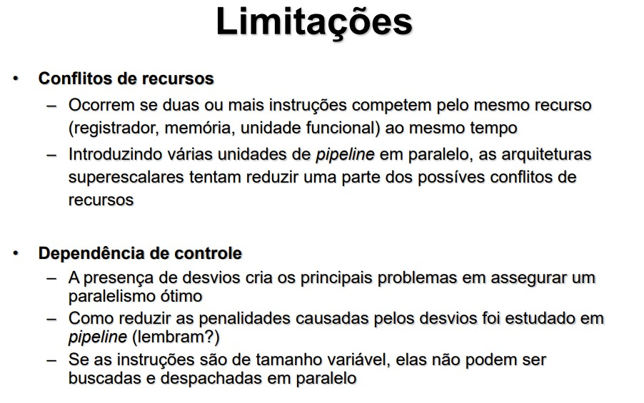
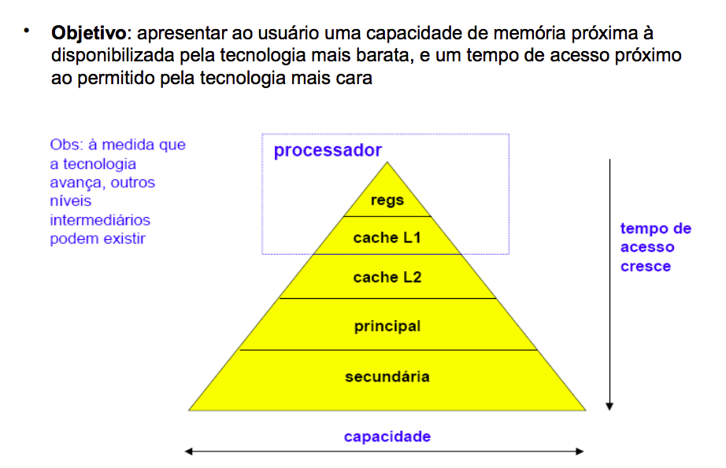
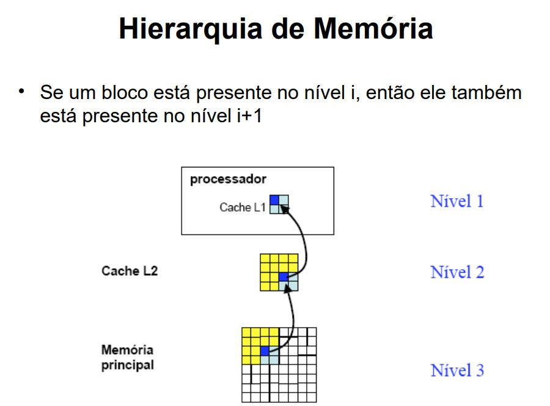
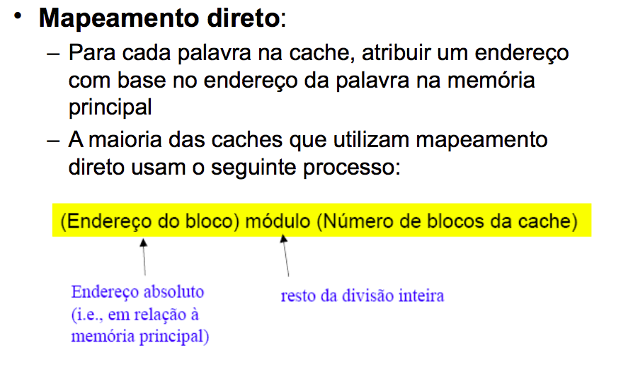
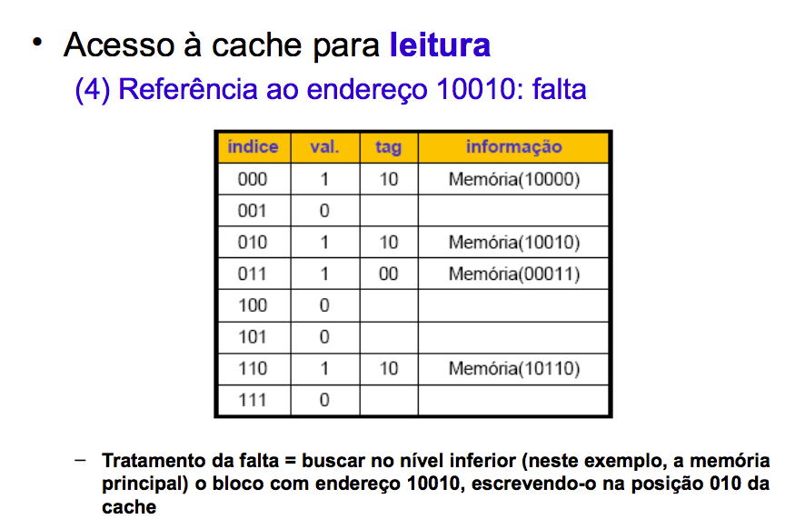
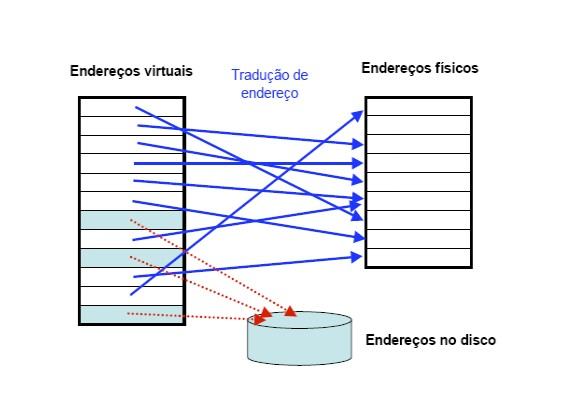

# Arquitetura X Organização
* **Arquitetura:** Corresponde aos aspectos visíveis a um programador em linguagem de máquina.
    * Ex: Repertório de instruções, número de bits utilizado para representar vários tipos de dados, etc..
* **Organização:** Diz respeito às unidades operacionais (Ex: CPU, unidade de memória, barramentos e sinais de controle) necessárias para implementar as especificações de uma arquitetura.
    * Geralmente o que é transparente ao programador.
* **Exemplo:** Operação de multiplicação
    * Aspecto arquitetônico: Saber se o computador provê uma instrução para esta operação.
    * Aspecto organizacional: Como a operação é implementada.


---
# RISC X CISC

O projeto do Conjunto de Instruções inicia com a escolha de uma entre duas abordagens, a abordagem RISC e a CISC. O termo **RISC** é a abreviação de **Reduced Instruction Set Computer**, ou Computador de Conjunto de Instruções Reduzido e **CISC** vem de **Complex Instruction Set Computer**, ou Computador de Conjunto de Instruções Complexo. Um computador RISC parte do pressuposto de que um conjunto simples de instruções vai resultar numa Unidade de Controle simples, barata e rápida. Já os computadores CISC visam criar arquiteturas complexas o bastante a ponto de facilitar a construção dos compiladores, assim, programas complexos são compilados em programas de máquina mais curtos. Com programas mais curtos, os computadores CISC precisariam acessar menos a memória para buscar instruções e seriam mais rápidos.

* CISC
* Micoroprogramação: Criar novas funções adicionadas diretamente ao hardware, facilitando o trabalho do programador.
* Resultado: Programas com poucas instruções, resultando uma quantidade menor de acessos à memória.
    * Motivações:
        *  Velocidade da memória vs. velocidade da CPU
        *  Densidade do código: Programas com poucas instruções representam menos acessos à memória.
        *  Compatibilidade entre as máquinas: Manter as instruções de modelos anteriores.
        *  Suporte para as linguagens de alto nível: Aproximar a linguagem das novas linguagens de alto nível e reduzir a disparidade semântica.
    * Desvantagens:
        * Processador **sobrecarregado, complexo, maior e mais lento**.


* RISC
	* 85%  do programa consiste em apenas três tipos de instruções: assinalamentos, comandos if e chamadas de procedimentos
	* Desnecessário a inclusão de microprogramas no processador que quase nunca são utilizados.
    * Instruções complexas devem ser incluídas somente quando o benefício no desempenho compensar a degradação de velocidade.
	* O uso de microprogramação deve ser evitado
			§ Aumento significativo da velocidade das memórias resultou na utilização de software em substituição aos microprogramas.
	* O compilador deve substituir eficientemente as operações complexas eliminadas do hardware.
			§ Otimização é fundamental.
    * O projeto de compiladores deve ser realizado juntamente com o projeto dos processadores.
Em suma, RISC é viável graças ao avanço do software.
    * Vantagens:
        * Processador **mais simples, mais rápido e mais barato.**
        * Menor número de circuitos internos, permite clocks mais altos.
        * Qual é o tamanho do código gerado para uma máquina RISC em relação a uma CISC para um determinado programa ?
            * Geralmente possui mais instruções.
            * Potêncialmente para executar de forma mais eficiente, possui instruções mais simples, com operandos inteiros (tempos de busca e execução de cada instrução é muito menor que o o de uma instrução mais complexa)
            * Trechos de instruções mais simples em linguagem de máquina podem ser melhor utilizados pelo compilador (ao invés de instruções complexas que não podem ser decompostas)
    * Desvantagens:
        * Não são boas para cálculo em ponto flutuante sem a ajuda de hardware.


    
* Qual a melhor abordagem ?
Sempre que este assunto é apresentado aos alunos, surge a pergunta crucial sobre qual é a melhor abordagem, a RISC ou a CISC? Esta é uma pergunta difícil e sem resposta definitiva. A melhor resposta que acho é de que depende do uso que se quer fazer do processador.

Processadores RISC geralmente resultam em projetos menores, mais baratos e que consumem menos energia. Isso torna-os muito interessante para dispositivos móveis e computadores portáteis mais simples. Já os processadores CISC trabalham com clock muito elevado, são mais caros e mais poderosos no que diz respeito a desempenho. Entretanto, eles são maiores e consomem mais energia, o que os torna mais indicados para computadores de mesa e notebooks mais poderosos, além de servidores e computadores profissionais.

Os processadores CISC iniciaram com processadores mais simples e depois foram incorporando mais funcionalidades. Os fabricantes, como a Intel e a AMD, precisavam sempre criar novos projetos mas mantendo a compatibilidade com as gerações anteriores. Ou seja, o Conjunto de Instruções executado pelo 486 precisa também ser executado pelo Pentium para os programas continuassem compatíveis. O Pentium IV precisou se manter compatível ao Pentium e o Duo Core é compatível com o Pentium IV. Isso tornou o projeto dos processadores da Intel e AMD muito complexos, mas não pouco eficientes. Os computadores líderes mundiais em competições de desempenho computacional utilizam processadores CISC.

Já o foco dos processadores RISC está na simplicidade e previsibilidade. Além do benefício da previsibilidade do tempo de execução ao Pipeline, ele também é muito interessante para aplicações industriais. Algumas dessas aplicações são chamadas de Aplicações de Tempo Real. Essas aplicações possuem como seu requisito principal o tempo para realizar as tarefas. Assim, o Sistema Operacional precisa saber com quantos milissegundos um programa será executado. Isso só é possível com processadores RISC, com poucos estágios de Pipeline, poucos tipos de instrução, execução em ordem etc. Mesmo que os processadores RISC sejam mais lentos do que os CISC, eles são mais utilizados nessas aplicações críticas e de tempo real, como aplicações industriais, de automação e robótica.

---
# MIPS

* **Monociclo:** O ciclo de clock deve ser longo o suficiente para executar a instrução mais complexa/longa (ex: load). O aumento da duração do ciclo é alcançado através da redução da frequência do clock. Menor frequência ocasiona ineficiência na utilização dos recursos, pois instruções simples acabam demorando o mesmo tempo que instruções longas. Apesar do CPI ser 1, a druação do ciclo é longa e, por isso, o desempenho é baixo. **Não há paralelismo de instruções.**

* **Multiciclo:** As instruções são divididas em etapas e cada etapa é executada em um ciclo de clock (ou seja, CPI > 1). A duração do ciclo de clock deve ser igual à etapa mais longa (pior caso, mas com granularidade de etapa de instrução, não de instrução completa como no monociclo). No multiciclo, não há perda (ineficiência) na execuçãode instruções mais simples (ex: branch) em comparação à execução de instruções mais complexas (ex: load). Em geral, a duração do ciclo de clock é bem menor que no monociclo, o que o torna mais performático.

* **Pipeline:** Sua unidade de controle é mais complexa. Períodos desbalanceados dos estágios reduzem o aumento de performance. Possui problemas de conflito como: Estruturais, de controle e de dados. Sua vantagem é a possibilidade da execução de multiplas instruções simultaneamente (sobreposição temporal). Isso possibilita uma redução de tempo médio da execução dos programas CPI=1 quando pipeline cheio.
---
# Pipeline
* A ideia principal sobre o pipeline é de que ele seja próximo ao uma linha de montagem.
* Em condições ideais, ele está bem dividido:
    * Todas as tarefas levam o mesmo tempo.
    * O pipeline encontra-se sempre cheio
        * Tem-se sempre uma instrução em cada etapa.
        * Tnew = Told / Netapas
        * CPIideal = 1
        * Ganho (ideal) face uma versão sem pipeline:
            * Ganhoideal  = Netapas
* **Conflitos ou Pipeline Hazards**
    * A existência de conflitos afetam o CPI médio, reduzindo o ganho de um pipeline.
    * Os possíveis conflítos de pipeline são:
        * Estruturais:
            * São as limitações físicas do processador. O exemplo mais simples é a separação da memória em memória de **dados** e memória de **instrução**, se isso não acontecer, as etapas de FI e WM não podem ser executadas ao mesmo tempo. ?
        * Dados
            * Ocore quando uma instrução depende do resultado de uma instrução anterior está no pipeline e ainda não está pronta. Imagine o trecho do programa a seguir:
            ```assembly
                I1: r1 = r2 + r3
                I2: r4 = r1 - r3
            A instrução I1 inicia primeiro e logo avança nas etapas do Pipeline. Logo depois dela vem I2. Quando I2 for buscar o valor de r1 na etapa FO, ele ainda não estará pronto, porque I1 ainda está em EI. A instrução I1 precisaria concluir a última etapa (WM) para que I2 pudesse executar FO. Nesses casos, dizemos que há uma Dependência de Dados. Isso cria uma bolha no Pipeline, o processador tem que avançar I1 até a conclusão de WM, e parar a execução de I2 e todas instruções seguintes até então. Só depois da conclusão de I1 é que o I2 e as próximas instruções seriam liberadas para continuar a execução.


        * Controle:
            * Esse tipo de conflito ocorre quando qualquer mudança no fluxo de controle do procesador. Ou seja, quando a execução deixa de ser meramente sequencial. Como vimos anteriormente, o pipeline vale a pena quando temos uma grande sequência de instruções sendo executadas. O processador confia que depois da instrução **I1** ele executará a I2, depois a I3, e assim sucessivamente. Mas o que acontece, por exemplo, se o processador estiver executando a instrução I10, e essa instrução ordenar que o programa salte para a instrução I30 ? Isso pode ocorrer se a instrução se tratar de uma repetição, ou uma chamada a uma função. A mudança de controle também pode ocorrer por meio de interrupção, provocada por um dispositivo de entrada e saída, ou pelo próprio sistema operacional, quando determina que um programa seja interrompido para passar a execução para outro. Quando há uma mudança no fluxo de execução desa maneira, todas instruções que estão no Pipeline são removidas, o fluxo é modificado e o Pipeline começa a ser preenchido novamente.

    * As técnicas de pipeline avançaram bastante e várias medidas foram tomadas para amenizar o prejuízo causado pelos riscos mencionados. Entretanto, nenhuma técnica é capaz de evitar todas as possíveis perdas de desempenho. Até boas práticas de programação podem ajudar a otimizar a execução dos programas, e os compiladores também ajudam bastante neste aspecto.
        

* Diminuir a instrução de bolhas
    * **Previsão de saltos (branch prediction)**
        * **Previsão estática**
            * Assume-se que o salto é sempre tomado (predict-taken)
            * Ou assume-se que o salto nunca é tomado (predict-not-taken)
        * Previsão dinâmica
            * A previsão depende do que se passou em saltos anteriores.
            * O estado da previsão de saltos vai mudando à mediad que o programa vai correndo.
            * Muito usado em processadores atuais.

    * **Em caso de uma previsão errada, perdem-se ciclos de processamento correspondentes às instruções que entretanto entraram no pipeline.**

* img1

* Inserir exemplos de contorno deste tipo de problemas.
---

# Arquiteturas superescalares
Há duas abordagens típicas atualmente, de forma a melhorar o desempenho:
- Superpipeline
    - É baseado na divisão dos estágios de um pipeline em sub-estágios e, portanto, aumentar o número de instruções que são suportadas pelo pipeline em um dado momento.
    - Divide cada estágio em **dois**, o período de ciclo de clock será reduzido pela metade.
    

    * Cuidados:
        - Conflito de dados
            - Pipeline maior -> mais dependências no pipe -> mais paradas
        - Conflitos de controle
            - Pipeline maior -> mais estágios para preencher -> saltos mais lentos
- Superescalar
    - Em uma arquitetura superescalar, várias instruções podem iniciadas **simultaneamente** e executadas **independentemente** 
    - Incluem todas as características do pipeline mas, além disso, elas podem ter várias instruções executando simultaneamente no mesmo estágio. Eles tem a capacidade de iniciar múltiplas instruções durante o mesmo ciclo do relógio.
    - Consiste de um número de **pipelines** que estão **trabalhando em paralelo**.
    

    - Os limites de execução paralela são muito semelhantes aos que impedem uma execução eficiente em qualquer arquitetura pipeline.    
      

    * Janela de execução
        -  A janela de execução é estendida sobre as bordas dos blocos básicos por previsão de desvio.
            * **Execução especulativa:** 
                -   Com execu
---
# Medidas de desempenho
Desempenho de um computador:

* Tempo de resposta (latência)
    * Quanto tempo leva para meu trabalho ser realizado?
    * Quanto tempo leva para realizar um trabalho específico ?
* Vazão (throughput)
    * Quantos trabalhos a máquina pode realizar em um intervalo de tempo?
    * Qual a velocidade média de execução ?
* Latência x Throughput
    * Se atualizarmos uma máquina com um novo processador, em que melhoramos ?
    * Se acrescentarmos uma máquina ao laboratório, em que melhoramos ?

* CPI (Ciclos por instrução)
    * Número de ciclos por instrução:
        * Específico para cada instrução em uma dada arquitetura;
        * Pode-se contabilizar o número de ciclos médio por instrução como medida de desempenho.
    * Considerando o número de instruções no cálculo de desempenho:
        * Nro de ciclos de relógio = nro de instrucoes * CPI
    *  Como diferentes instruções executam em um número de ciclos de relógio diferentes, a CPI é dada por uma média ponderada das instruções executadas pelo programa.
    * Aplicações com intensas operações de ponto flutuante acarretam em um maior CPI

* MIPS (Milhões de instruções por segundo)
    * Pode ser grande para programas que usam instruções simples.


    * Porque a métrica milhões de instruções por segundo (MIPS) é controversa?
        * A métrica MIPS de uma CPU refere-se a quantas instruções de código de máquina de baixo nível um processador por executar em um segundo. Usar este número como forma de medir o desempenho do processador é completamente **sem sentido**, pois dois chips diferentes não utilizam exatamente os mesmos tipos de instruções, método de execução, etc.. Por exemplo: Em um chip, uma única instrução pode fazer muito pouco, mas é tratada de fomra mais eficiente (RISC). Além disso, diferentes instruções em um mesmo chip CISC podem fazer quantidades muito diferentes de operações (por exemplo, uma instrução aritmética simples pode levar apenas um ciclo de relógio para completar, enquanto fazer algo como divisão de ponto flutuante ou uma operação de raiz pode levar 20 a 50 ciclos de clock.)

* Speedup
    * Limitado pela Lei de Amdahl, que afima que a melhoria de desempenho obtida com o uso de um modo de execução mais rápido é limitada pela fração do tempo que o modo mais rápido pode ser usado:
    

    * Se Speedup > 1, a versão com aprimoramento reduzio o tempo de execução (ficou mais rápida)
    * Se speedup < 1, a versão com aprimoramento aumentou o tempo de execução (ficou mais lenta)


* Outras medidas
    


## Lembrete: Existe MIPS Arquitetura e MIPS medida de desempenho

---

# Memória
O sistema de memória é uma das principais partes do computador, juntamente com o processador. Todos os programas e seus dados são mantidos no sistema de memória e ele é responsável por entregar o mais rapidamente para o processador quando solicitado. Não é uma tarefa simples porque as memórias tendem a ser muito mais lentas do que o processador, e sua tecnologia não tem avançado tão rapidamente quanto a dos processadores
* Hierarquia de memória
    * As tecnologias mais avançadas até o momento são chamadas SRAM (Static Random-Access Memory). Elas são mais utilizadas em registradores e memórias cache. Por serem mais caras estão presentes nos computadores em menores quantidades. Já a memória principal é fabricada utilizando a tecnologia DRAM (Dynamic Randon-Access Memory), por serem menos sofisticadas, são mais baradas que as SRAM. Por isso elas são montadas em maior quantidade do que as memórias cache e os registradores. Já as memórias secudárias são formadas por tecnologias de memórias magnéticas e ópticas (HD). Não são voláteis e seu valor é mais baixo.

* Princípio da localidade
    * Muitos dizem que o sistema de memória se inspirou no sistema de memória do corpo humano, onde lembranças mais recentes são armazenadas em memórias menores de curta duração e lembranças mais antigas e pertinentes são armazenadas em memórias de longa duração e capacidade. No sistema computacional, o sistema de memória se baseia no princípio da localidade, que se divide em temporal e espacial.
    
    
        * **Temporal:** Diz que um dado acessado recentemente tem mais chances de ser usado novamente, do que um dado usado há mais tempo. Isso é verdade por que as variáveis de um programa tendem a ser acessadas várias vezes durante a execução de um programa, e as instruções usam bastante comandos de repetição e sub-programas, o que faz instruções serem acessadas repetidamentes. Sendo assim, o sistema de memória tende a manter os dados e instruções recentemente acessados no topo da hierarquia de memória.
        * **Espacial:** Diz que há uma probabilidade de acesso maior para dados e instruções em endereços próximos àqueles acessados recentemente. Isso também é verdade porque os programas são sequenciais e usam de repetições. Sendo assim, quando uma instrução é acessada, a instrução com maior probabilidade de ser executada em seguida, é a instrução logo a seguir dela. Para variáveis, o princípio é semelhante. Variáveis de um mesmo programa são armazeandas próximas umas às outras, e vetores e matrizes são armazenados em sequência de acordo com seus índices. Baseado neste princípio, o sistema de memória tende a manter dados e instruções próximos aos que estão sendo executados no topo da hierarquia de memória.

    
    
    


## Memória cache
* Definição de **cache**: o lugar seguro para esconder ou guardar algo. É o nome usado para designar o nível de memória entre o procesador e a memória principal.
* Atualmente, cache designa qualquer memória que explore o princípio da localidade (temporal e espacial)



* **Tags** são utilizadas em conjunto com o endereço de mapeamento, de modo a compor o endereço completo da memória principal.


* E como reconhecer se um bloco da cache possui uma informação válida ?
* EX: Quando o processador é inicializado, algo deve sinalizar que a cache está vazia.
* **Solução:** Incluir um **bit de validade**
    * Se o bit de validade for zero, a informação contida naquele bloco da cache não e válida.

    


* Mapeamento associativo: 
    * **Uma linha da memória principal pode residir em qualquer linha da memória cache.**
    * Não há nenhuma relação entre suas localizações;
    * O endereço da linha a ser acessada é comparado com todos os endereços das linhas residentes na memória cache para ver se eal se encontra na memória cache.
        * Quando ocorrer uma falta, a linha é carregada preferencialmente em qualquer linha ainda livre na memória cache;
        * A substituição só se dá se todas as linhas estiverem ocupadas.
        * O mapeamento associativo termina sendo mais eficiente do que o mapeamento direto no momento de alocar blocos da memória na Cache. Só haverá espaço inutilizado se não houver acesso suficiente à Memória Principal. A desvantagem deste tipo de mapeamento está no momento de buscar um bloco na Cache. Imagine agora que alguém chegue no cinema cheio a procura de uma pessoa. Como encontrá-la? Será necessário percorrer todas cadeiras para verificar se a pessoa se encontra em alguma delas. Para o sistema computacional, essa busca é custosa o que resulta na utilização deste mapeamento apenas se a Cache não for grande demais.

* **Escrita na cache:**
    * O esquema Write-through não favorece o desempenho, qualquer escrita faz com que a memória principal também seja escrita. 
        * Como funciona write-through com buffer de escrita:
            1. O buffer de escrita armazena o dado que aguarda para ser escrito na memória;
            2. Após escrever o dado na cache e no buffer de escrita, o processador pode continuar a execução das instruções;
            3. E se o buffer de escrita estiver cheio quando o processador executar uma escrita;
                - O processador precisa para raté que haja espaço no buffer.  
            4. E se a velocidade da memória para completar as escrita for menor que a taxa à qual o processador está gerando as escritas? 
                - Nenhum buffer (por maior que seja) conseguirá resolver o problema.
                - O tamanho do buffer de escrita depende dessa relação.

    * Esquema **write-back**:
        * Quando ocorre uma escrita, o novo valor é escrito apenas no bloco da cache;
        * Tal bloco somente será escrito na memória principal quando ele tiver que ser substituído na cache;
        * O esquema pode aumentar bastante o desempenho, principalmente quando o processador puder gerar escritas tão rapidamente quanto estas puderem ser tratadas pela memória principal.
              
## Memória virtual

* **Memória principal (DRAM)**
    * Tamanho limitado;
    * Tempo de acesso diversas vezes maior que SRAM.
* **Memória secundária (disco magnético)**
    * Grande capacidade de armazenamento;
    * Tempo de latência milhares de vezes maior que DRAM (Ou seja, da ordem de microssegundos ou milissegundos)
    * Pode não ser possível manter um programa inteiro na memória principal, e deseja-se rodar vários programas ao mesmo tempo;
    * **Solução**: manter apenas as partes ativas do(s) programa(s) na memória principal.
    * A memória virtual é uma técnica que dá ao programador a ilusão de poder acessar rapidamente um grande espaço de endereçamento.
    * Seus objetivos:
        * Permitir que haja um meio seguro e eficiente de se compartilhar informações (armazenadas na memória) entre vários programas e minimizar os problemas causados pela existência de uma pequena quantidade de memória principal.

    * A memória virtual gerencia **automaticamente** os dois níveis de hierarquia: **memória principal** (DRAM) e **memória secundária** (disco magnético)

    * **Principais conceitos:** 
        * **Página:** É um blooco de dados de tamanho fixo
        * **Falta de página:** É uma falta no acesso à memória virtual
        * Usando memória virtual: o processador sempre gera um **endereço virtual**, que é traduzido para um endereço real por meio da **MMU** (memory management unit), um sistema **HW+SW**.
        * O edenreço real (também chamado de físico) é, então, usado para acessar a memória.
        

    * **Memória virtual e relocação de código**
    * A técnica de memória virtual simplifica a carga dos programas para execução a partir da relocação.
    * A relocação mapeia os endereços virtuais usados por um determinado programa em endereços físicos (antes de tais endereços serem usados para acessar a memória);
    * A técnica de relocação permite que um programa seja carregado em **qualquer posição da memória principal**;
    * Todos os sistemas de memória virtual relocam os programas por meio de blocos de tamanho fixo, as páginas
    

    * **Projeto de memória virtual**
        * A ocorrência de uma falta de página consome muitos ciclos de relógio;
        * Esse tempo é denominado pelo tempo para obter o primiero endereço de uma página de tamanho típico;
        * A penalidade imensa de uma falta de página conduz a decisões importantes, com uma relação ao projeto de sistemas de memória virtual.
    * Características dos sistemas de memória virtual
        * As páginas devem ser grandes o suficiente para amortizar o tempo de acesso muito grande (geralmente, de 16kb a 64kb)
        * Uma técnica de colocação totalmente associativa tende a proporcionar uma baixa taxa de falta de página;
        * As faltas de página podem ser tratadas por software em função do overhead introduzido ser pequenom quando comparado ao tempo de acesso ao disco;
            * Isso permite o uso de algoritmos mais eficientes para a escolha de como colocar as páginas.
        * Os sistemas de memória virtual usam **write-back**.

    * **Colocação e localização de uma página na memória**
        * Principal objetivo: No projeto de um sistema de memória virtual: redução das faltas de página;
        * Essa redução é obtida por meio do uso de técnicas otimizadas para a colocação das páginas na memória principal;
            * Politica de substituição de blocos mais eficiente;
            * Redução da penalidade das faltas por meio de mais níveis de hierarquia de memória.

    

    

    * **Falta de página**
        * Bit de residênica = 0 indica falta de página
        * Sistema operacional assume o controle, por meio do mecanismo de exceção.
        * O sistema operacional precisa:
            * Encontrar a página faltante no nível hierárquico inferior (geralmente, no HD ou no SSD)
            * Decidir que lugar da memória principal deve ser colocada a página requisitada.
        * O endereço virtual por si só, não informa em que posição do HD está a página que gerou a falta.

        
        


        * **Escrita**
        * A escrita no disco consome milhões de ciclos do relógio
        * O esquema write-back é usado: página é copiada para o disco no momento em que for substituída (nomenclatura: "copy-back")