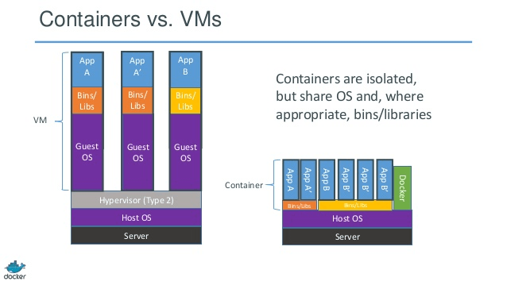
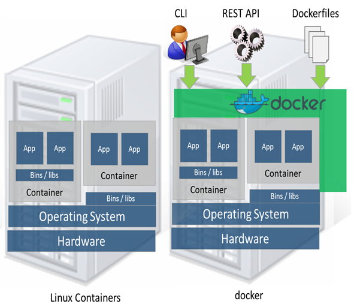

# Docker - 101 | 01
Ao longo dos próximos posts, pretendo explicar a ideia geral sobre a plataforma **Docker**, explicando suas diferenças quando comparado ao modelo tradicional de virtualização ao qual estamos acostumados. Na medida do possível também vou tentar mostrar alguns exemplos de execução e configurações. 
Antes de entrar no detalhe sobre **o que é e como funciona** de fato o Docker, alguns conceitos devem ser esclarecidos:

- **Container**
    * O docker cria pacotes de software em unidades padronizadas chamadas de **container**, que possuem tudo o que a aplicação necessita para ser executada, inclusive, bibliotecas, ferramentas do siste,a código e runtimes;
    * Diferentemente dos modelos de virtualização "tradicional", aonde temos um SO completo e isolado, no Docker temos **recursos** isolados que utilzam bibliotecas do kernel em comum (entre host e container), isso é possível pois o Docker utiliza como backend o [LXC](https://linuxcontainers.org/lxc/introduction/).

    

- **Quais as vantagens de se utilizar um container no Docker?**
    * Conforme dito, um **container possibilita o empacotamento** de aplicações ou ambientes e mais, como este container é "independente",ou seja, é possível portá-lo para qualquer outro host que possua o Docker instalado. O que significa que não será necessário preocupar-se com pré-requisitos (Ex: versão do So, permissionamento, etc..) instalados no ambiente destino, desta forma, é minimizada a divergência entre os ambientes, assim como a frase: "Mas no meu computador funcionou" :)
    * O uso de hardware para virtualização caí drásticamente pelo simples fato de não termos que realizar o deploy de um **SO completo** para qualquer aplicação;
    * Um outro ponto interessante é a possibilidade da criação de imagens (containers customizados prontos para o deploy) a partir de arquivos de definição chamados **Dockerfiles**;
    * O Docker é uma ferramenta que possibilita uma rápida escalada horizontal, ou seja, por meio de imagens pré-definidas, podemos realizar rapidamente o aumento no número de containers que atendem determinada aplicação.

- **Mas e como diabos o Docker funciona ?**
    * Como dito, Docker utiliza como **backend** o [LXC](https://linuxcontainers.org/lxc/introduction/), que é um método de virtualização em nível de sistema operacional e que permite executar "vários" sistemas Linux isolados (container) em um único host de controle (LXC HOST). O LXC não fornece uma máquina virtual, mas sim, um ambiente virtual que tem sua própria CPU, memória, bloco I/O, rede, espaço, etc.. Logo, ele permite o controle sobre o **quanto** de recurso poderá ser alocado para cada container.
    
    
        *A imagem acima demonstra a diferença entre o LXC "puro" e o Docker.*

    *  

## Referências
https://www.mundodocker.com.br/o-que-e-docker/ 
https://aws.amazon.com/pt/docker/
https://docker.com/
http://www.sinestec.com.br/blog/o-que-e-container-docker/
https://blog.docker.com/2016/05/docker-101-getting-to-know-docker/
https://www.docker.com/sites/default/files/WP_Docker%20and%20the%203%20ways%20devops_07.31.2015%20%281%29.pdf

 ### Dica de curso gratuito 
https://www.youtube.com/watch?v=0xxHiOSJVe8&list=PLf-O3X2-mxDkiUH0r_BadgtELJ_qyrFJ_