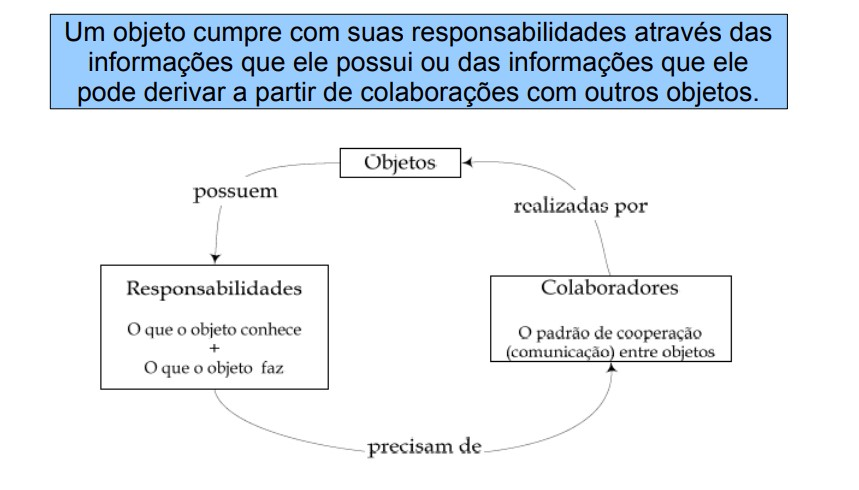
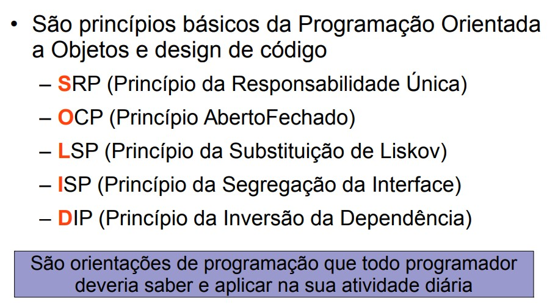
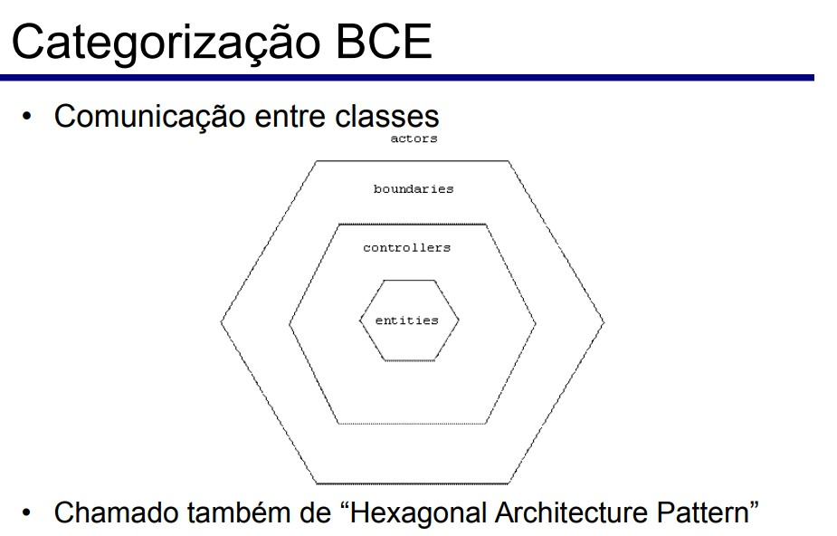
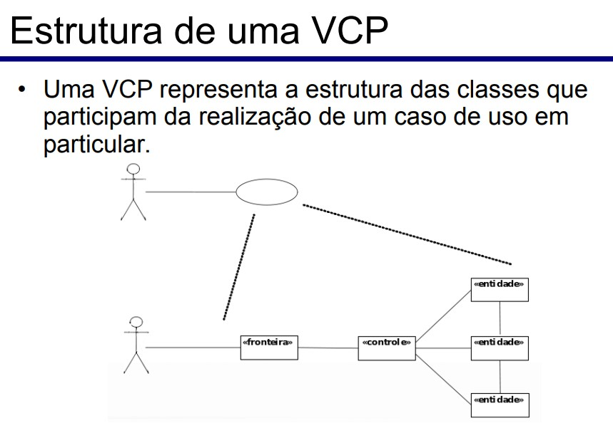
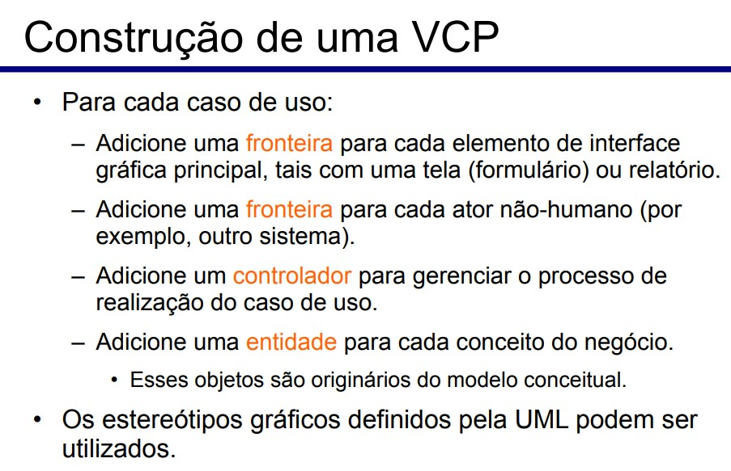
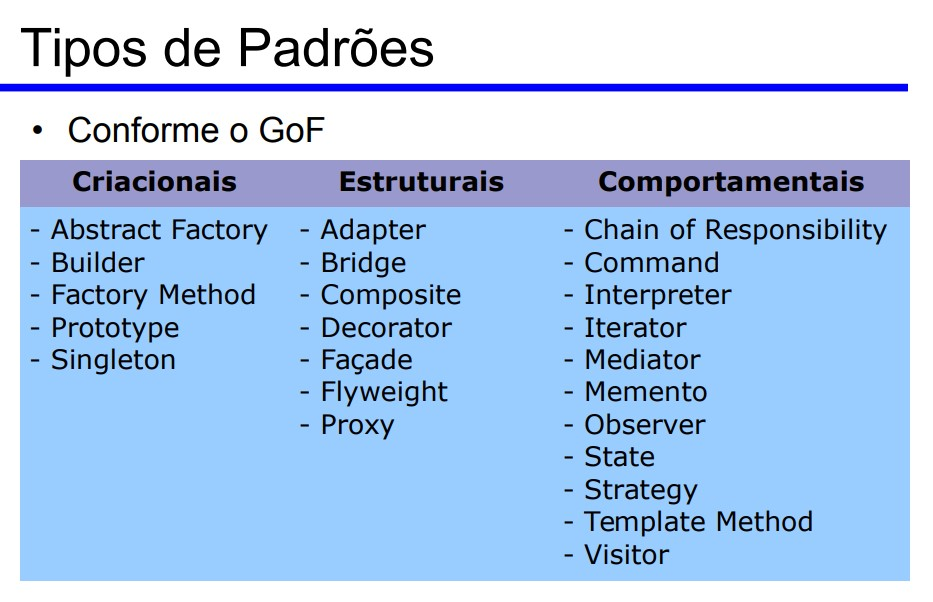
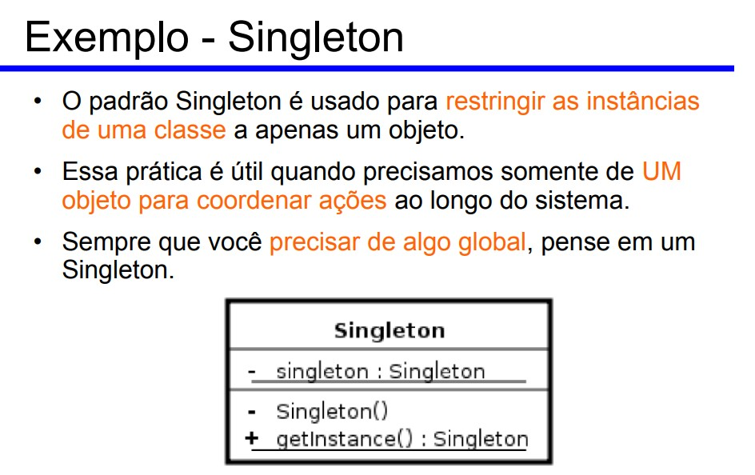
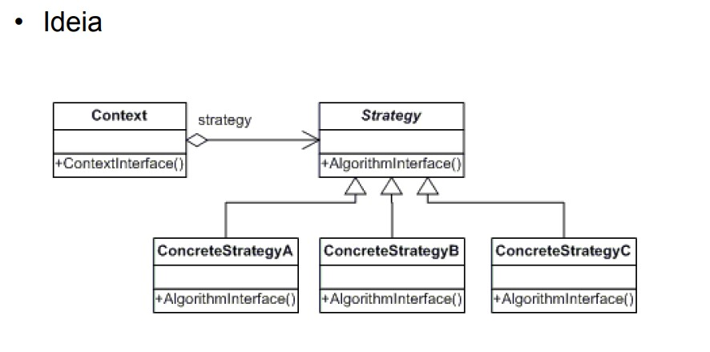

# Resumo para a prova de desenvolvimento II
# Aula 01
- O que é um modelo? 

	* Um modelo é uma simplificação da realidade.
	* Um bom modelo inclui elementos que são relevantes para o nível de abstração desejado.
	* Um modelo pode referir*se à estrutura, enfatizando a organização do sistema, ou referir*se ao comportamento enfatiznado questões dinâmicas do sistema.
* Em que ajuda ter um modelo ?
	* Documentar as decisões tomadas pela equipe;
	* Especificar a estrutura e o comportamento do sistema;
	* Visualizar o sistema como desejamos que este realmente venha a ser;
	* Fornecer um template que guiará na construção do sistema.
* Uma modelagem visual permite:
	* Detectar e avaliar mudanças na arquitetura;
	* Comunicar as mudanças na arquitetura;
	* Sincronizar o modelo e o código fonte durante cada interação realizada.
* UML
    *  Um conjunto de notações gráficas voltado para o projeto de sistemas de softwares OO.
	* Seu uso vem do fato de que linguagens de programação não possuem um nível de abstração suficientemente alto.
	* Um diagrama auxilia no processo de comunicação e compartilhamento do conhecimento.

----------

- O que é engenharia de software?

	* É a aplicação de uma abordagem sistemática, disciplinada e quantificável ao desenvolvimento, operação e manutenção de software.
	Cobre as seguintes áreas de conhecimento:
		* Requisitos de software;
		* Projeto de software;
		* Construção de software;
		* Teste de software;
		* Manutenção de software;
		* Gerência de configuração de software;
		* Gerência de engenharia de software;
		* Processo de engenharia de software;
		* Ferramentas e métodos da engenharia de software;
		* Qualidade de software;
* Preocupações:
    * Em um programa do mundo real, devemos nos preocupar em fatores como:
		* Escopo;
		* Custo;
		* Prazo;
		* Qualidade.

	* Causas de falhas:
		* Projetos mal dimensionados;
		* Escolha de metodologias erradas;
		* Falta de atenção com a mudança de requisito;
		* Falta de atenção com o usuário.

* Processo de software:
	* Muitas metodologias surgiram ao longo do tempo para organizar o desenvolvimento de software.
	* A maioria delas propõe um processo de desenvolvimento.
	* Vários processos foram propostos, a maioria deles enquadra-se dentro de um modelo: Cascata, Iterativo ou Ágil.

* Modelo cascata
	* Mais antigo e é o modelo mais rígido.
	* Modelo de desenvolvimento sequencial, no qual o desenvolvimento é visto como um fluir constante para frente (como uma cascata) através das fases de análise de requisitos, projeto, implementação, testes, implantação e manutenção de software.
	* O processo supõe o cumprimento da etapa anterior e não oferece meios de corrigir erros em fases anteriores.
	* Caso um erro ocorra, todo o processo deve ser reinicializado.

* Modelo iterativo
	* Muitas metodologias surgiram inspiradas em metodologias tradicionais da engenharia, cujos princípios baseam*se na separação entre projeto e construção e na previsibilidade dos requisitos.
	* Isso quer dizer que todos os requisitos devem ser levantados na etapa do projeto.
	* Em se tratando de software, nem sempre é possível obter com exatidão todos os requisitos de um projeto antes de sua construção.
	* Requisitos sempre mudam, por conta de alterações do cliente ou por erros de interpretação.
	* Neste caso, é necessário saber o que fazer quando ocorre alguma mudança. Adaptação é a melhor saída.
	* O desenvolvimento iterativo é uma forma adequada de se lidar com os requisitos em um ambiente adaptativo, onde o planejamento é realizado iteração pós iteração.
	* Neste modelo, a cada iteração é possível realizar correções constantes das etapas anteriores.
	* Entretanto, após cada iteração não haverá um software completo e integrado. O que ainda deverá ser realizado por uma fase de estabilização antes da implantação.

* Metodologias ágeis
    * No processo ágil, os processos são baseados **nos princípios iterativos** e utilizam **feedback** ante o planejamento, como guia do desenvolvimento.
        * A estratégia **não é evitar a mudança**, mas aceitá-la como parte do processo, estando preparado para quando ela ocorrer.
    * Processos ágeis **não suportam um planejamento de longo prazo** de escopo, o planejamento é realizado iteração após iteração.
        * Em geral, os processo ágeis entregam ao usuário um conjunto melhor de funcionalidades conforme o custo benefício.
    * Nas metodologias ágeis, **pessoas estão em primeiro plano**, as ferramentas e processos estão em segundo plano.

        

-----

* Ciclo de vida do software

    
    * A fase de análise é o ciclo de vida de desenvolvimetno no qual são definidos os requisitos para a solução de um problema.
- Atividades desta fase:
    - [x] São examinadas as reais necessidades do usuário
    - [x] São definidas todas as propriedades que o sistema deve ter
    - [x] São identificadas as situações de execeção do sistema.
###  O resultado final desta fase é uma especificação funcional do sistema.

------

- Projeto de sistemas
    * **Projeto:** É um empreendimento único, de duração determinada, formalmente organizado e que congrega e aplica recursos visando o cumprimento de objetivos pré-estabelecidos.
        * É um desenho, esboço ou plano de forma ou estrutura de trabalho.
        * Software Design

----

## Aula 02 - Modelos, Visões UML

---

- **Modelo Conceitual**
    - É aquele que define as características do sistema através de uma representação fiel ao ambiente observado, independente de quaisquer aspectos de implementação.
- **Modelo lógico**
    - É uma adaptação para limitações impostas por tecnologias e técnicas de implementação, geralmente obtido a partir da aplicação de regras de derivação sobre um modelo conceitual já obtido.
- **Modelo físico**

### Modelos de sistema
-   Na **oo**, considerando que as classes são elaboradas com **base na realidade** e depois construídas de acordo com essa elaboração, não há necessidade de se manter **três modelos** distintos. 
    - Na prática não existem estes três modelos; o que existe é o **Modelo de sistema**, que é **único**.

### Visões UML
- Para compreender a *arquitetura* de um sistema OO, são necessárias várias **visões complementares e interrelacionadas.**
- Uma visão de arquitetura pode ser definida como:
    - Uma abstração da realidade;
    - Apresentação das entidades relevantes para a perspectiva em questão;
    - Visões são fatias do modelo.
-  Nem todo sistema requer todas as visões. Por exemplo, um sistema a ser implementado em uma única máquina, não necessitaria de um diagrama de implementação.

     
   
    *Visões UML*

---
# Aula 03
## Princípios de orientação a objetos
- Um objeto possui dois componentes chave:
	- Estado
	- Comportamentos

- Um objeto possui um **estado**:
	- Conjunto de **informações**.
	- Caracteriza condição na qual um objeto existe;
	- Normalmente muda com o tempo.

- Um *objeto* possui **comportamentos**
	- Representados pelas *operações*;
	- Definem quais mensagens o objeto sabe receber e como reaje/responde a cada uma delas;
	- Podem modificar o estado do objeto.

- Princípios da orientação a objetos
	- **abstração**
	- **encapsulamento**
	- **modularidade**
	- **hierarquia**

- **Polimorfismo**
	- Habilidade de esconder diferentes implementações com uma interface.

- Generalização e herança
	- **Generalização:** Agrupar classes, extraindo características comuns.
	- **Herança:** Escreve apenas "o que é diferente" em relação ao que já existe.

### Diagramas de classes e objetos
* Na prática, o diagrama de classes é bem mais utilizado que o diagrama de objetos.
	* O modelo de objetos também é conhecido como modelo de classses.
* Há três níveis sucessivos de detalhamento:
	* Análise → Especificação (Projeto) → Implementação.

#### Modelo de classes de análise
* Representa os termos do domínio do negócio:
	* Ideias, coisas e conceitos do mundo real.
	* **Objetivo:** Descrever o *problema* representado pelo sistama a ser desenvolvido, sem considerar características da *solução* a ser utilizada.
	* Duas etapas:
		* modelo conceitual (modelo de domínio)
		* modelo da aplicação.
	* Elementos de notação do diagrama de classes normalemnte usados na construção do modelo de análise:
		* Classes e atributos; associações; composições e agregações (com seus adornos); classes de associação; generalizações (herança)

		

## Diagrama de classes
* Notação UML: "Caixa" com no máximo três compartimentos exibidos. 
	* Detalhamento utilizado depende do estágio de desenvolvimento e do nível de abstração desejado.

	

	

* Associações:
	* Para representar o fato de que os objetos podem se relacionar uns com os outros, utilizamos associações.
	* Uma associação representa relacionamentos (ligações) que são formados entre objetos durante a *execução* do sistema.
	* Note que, embora as associações sejam representadas entre classes do diagrama, tais associações representam **ligações possíveis** entre os *objetos* das classes envolvidas.

	

* Classe associativa:
	* É uma classe que está ligada a uma associação, em vez de de estar ligada a outras classes.
	* É normalmente necessária quando duas ou mais classes estão associadas, e é necessário manter informações sobre esta associação.
	* **Sinônimo:** Classe de associação.

	

	* **Associações reflexivas:** Tipo especial de associação que representa ligações entre objetos que pertencem a uma mesma classe.
	* Não indica que um objeto se associa a ele próprio.
* Algumas particularidades das agregações/composições:
	* São assimétricas, no sentido de que, se um objetod e **A** é parte de um objeto de **B**, o objeto de **B** não pode ser parte do objeto **A**.
	* Propagam comportamento, no sentido de que um comportamento que se aplica a um todo automaticamente se aplica às suas partes.
	* As partes são normalmente criadas e destruídas pelo todo. Nã classe do objeto todo, são definidas operações para adicionar e remover as partes.
	* As diferenças entre agregação e composição não são bem definidas. A seguir, as diferenças mais marcantes entre elas.
	* **Destruição de objetos**
		* Na agregação, a destruição de um objeto todo não implica necessariamente na destruição do objeto parte.
	* **Pertinência**
		* Na composição, os objetos parte pertencem a um único todo.
			* Por essa razão, a composição é também denominada **agregação não compartilhada**
	* Em uma agregação, pode ser que um mesmo objeto participe como componente de vários outros objetos. 
		* Por essa razão, a agregação é também denominada **agregação compartilhada.**

	

### Propriedades da herança
* **Transitividade:** Uma classe em uma hierarquia herda propriedades e relacionamentos de *todos* os seus ancestrais.
	* Ou seja, a herança pode ser aplicada em vários níveis, dando origem a hierarquia de generalização.
	* Uma classe que herda propriedades de uma outra classe pode ela própria provir como superclasse.
* **Assimetria:** Dadas duas classes A e B, se A for uma generalização de B, não pode ser uma generalização de A.
	* Ou seja, não pode haver ciclos em uma hierarquia de generalização.

### Classes abstratas
* Classes abstratas não geram instâncias diretas.
* São utilizadas para organizar e simplificar uma hierarquia de generalização.
	* Propriedades comuns a diversas classes podem ser organizadas e definidas em uma classe abstrata a partir da qual as primeiras herdam.
* Subclasses de uma classe abstrata também podem ser abstratas, mas a hierarquia deve terminar em uma ou mais classes concretas.

----
# Aula 03

### RUP (Rational Unified Process)
* É um processo iterativo:

	
* Principais ideias
	* Riscos são enfrentados logo
	* A mudança é mais gerenciável
	* Há um maior nível de reuso
	* A equipe pode aprender ao longo do caminho
	* O produto tem uma melhor qualidade
* Disciplinas:
	 

* Processo:
	 
* Fases:
	 
	 * Iniciação
		* Estabelece a visão, escopo e um plano inicial.
	* Elaboração
		* Projeta, implementa e testa uma arquitetura central, resolução de riscos altos, completa o plano.
	* Construção
		* Implementa iterativamente elementos restantes de menos risco e mais fáceis, prepara implementação.
	* Transição
		* Testes beta e implementação. Fornece o sistema a seus usuários.

---
# Aula 04

* Técnicas de identificação
	* Várias técnicas (de uso não exclusivo) são usadas para identificar classes
	1. Categorias de conceitos
		1. Usar uma lista de conceitos comuns
			1. Conceitos concretos. Ex: Edifícios, carros, etc..
	2. Análise textual de Abbot
		* Estratégia: Identificar termos da narrativa de casos de uso e documento de requisitos que podem sugerir classes, atributos, operações.
		* São utilizadas diversas fontes de informação sobre o sistema: Documento e requisitos, modelos do negócio, glossários, conhecimento sobre o domínio, etc..
		* Para cada um desses documentos, os nomes (**substantivos e adjetivos**) que aparecem no mesmo são destacados. 
		* Após isso, os sinônimos são removidos (permanecem os **nomes** mais **significativos para o domínio do negócio** em questão).
		* **Desvantagens:**
			* Variações linguísticas, alguma classe importante pode não estar explícita no texto, etc..
	3. Análise de casos de uso
		* O caso de uso é utilizado como ponto de partida.
			* **Premissa:** Um caso de uso correspondente a um comportamento específico do sistema. Esse comportamento somente pode ser produzido por objetos que compõem o sistema.
		* Estudar descrição textual de cada caso para identificar classes candidatas, analisar fluxos (principais, alternativos, etc..). Após toda a análise, as classes deverão ser identificadas.
		* Categorização BCE (Boundary, Control, Entity)
			* *Entidade:* Usualmente objetos do domínio do problema.
			* *Fronteira:* Atores interagem com esses objetos.
			* *Controle:* Servem como intermediários entre objetos de fronteira e entidade, definindo o comportamento de um caso de uso específico.
	4. Identificação dirigida a responsabilidades
		* Nesta técnica, a ênfase está na **identificação da classe a partir de seus comportamentos** relevantes para o sistema.
		* O método dirigido a responsabilidades enfatiza o **encapsulamento** da estrutura e do comportamento dos objetos.
		* Os detalhes internos à classe (como ela faz para cumprir com suas responsabilidades) devem ser abstraídos.
		* Uma **responsabilidade é uma obrigação** que um objeto tem para com o sistema no qual ele está inserido.
		* Se um objeto tem uma responsabilidade com a qual não pode cumprir sozinho, ele deve requisitar **colaborações** de outros objetos.

			

## GRASP e SOLID
### Grasp (General Responsibility Assingment Software Patterns)
* São padrões básicos que preconizam a distribuição de responsabilidades entre classes.
	* Responsabilidade: Um contrato ou obrigação de um objeto
		* Responsabilidade de fazer;
		* Responsabilidade de conhecer.
* Padrões fundamentais
	* Expert (Especialista)
		* Classe que tem a informação necessária para honrar a responsabilidade.
		* Atribuir responsabilidade ao especialista da informação (dono).
	* Creator (Criador)
		* Responsável pela **criação** (ativar a criação) de uma **nova instância** de alguma classe. Ex: Atribuir a classe **B** a responsabilidade de criar uma instância da classe **A** em determinadas situações. 
	* Controller (Controlador)
		* Responsável por **tratar os eventos** do sistema.
		* Controlador de *caso de uso*
			* Usar a mesma classe controladora para todos os eventos de sistema do mesmo caso de uso.
		* Controlador por *entidades* 
			* Usar a mesma classe controladora para todas as operações de uma entidade (ou conjunto de entidades)
	* Low Coupling (Baixo acoplamento)
		* Pouca dependência entre classes, ou seja, **reduzir** o número de objetos dependente e/ou **simplificar a interface** de comunicação.
	* High Cohesion (alta coesão)
		* Atribuir uma responsabilidade de modo que a **coesão** permaneça **alta**
			* Cada objeto faz "**uma coisa**" só, objetos devem ter **poucas responsabilidades**.

### SOLID 

* SRP 
	* Cada classe deve ter uma responsabilidade clara a focada.
* OCP
	* O código deve ser aberto para extensão mas fechado para alteração.
* LSP
	* Uso consciente e correto do polimorfismo
* ISP
	* Trata de coesão entre interfaces
* DIP
	* Módulos de alto nível não devem depender de módulos de baixo nível. Ambos devem depender de abstrações.

### BCE

### VCP
* Uma visão de classes Participantes é um diagrama das classes cujos objetos participam da realização de determinado caso de uso.
* Em uma VCP, são representados objetos de fronteira, de entidade e de controle para um caso de uso particular.
* Uma **VCP** é definida através da utilização da categorização **BCE**.

* Regras estruturais em uma **VCP**
	* **Atores** somente podem interagir com objetos de **fronteira**.
	* Objetos de **fronteira** somente podem interagir com **controladores e **atores**.
	* Objetos de **entidade** somente podem interagir (receber requisições) com **controladores**
	* **Controladores** somente podem interagir com objetos de **fronteira** e objetos de **entidade**, e com (eventuais) outros **controladores**.

---
# Padrões de projeto
### Padrões Singleton e Stragegy
* É da natureza do desenvolvimento de software o fato de que os **mesmos problemas** tendem a acontecer diversas vezes.
* Um **Padrão de projeto** corresponde a um esboço de uma **solução reusável** para um problema comumente encontrado em um contexto particular.
* **Design Pattern**
	* Um Pattern descreve um problema que ocorre com frequência em nosso ambiente, e então, explica a essência da solução para este problema, de forma que tal solução possa ser utilizada milhões de outras vezes.
	* **Algoritmos** não são padrões de projeto!!
		* São soluções prontas para resolver problemas computacionais, não de projetos.
* Por que aprender padrões ?
	* **Identificar problemas comuns** de engenharia de software
	* **Utilizar soluções testadas** e comprovadamente eficientes.
	* Padrões utilizam as **melhores práticas** de OO com herança, polimorfismo, composição, abstração, etc..
	* **Vocabulário comum** para comunicar-se em alto nível.
	* Todo padrão inclui:
		* Nome
		* Problema
		* Solução
		* Consequencias
	
* Os padrões GoF foram divididos em três categorias:
	* **Criacionais:** Procuram separar a operação de uma aplicação de como os seus objetos são criados.
	* **Estruturais:** Provêem generalidade para a que a estrutura da solução possa ser estendida no futuro.
	* **Comportamentais:** Utilizam herança para distribuir o comportamento entre subclasses, ou agregação e composição para construir comportamento complexo a partir de componentes mais simples.

## **Singleton**
* Usado apra **restringir instâncias de uma classe** a apenas um objeto.
* Essa prática é útil quando precisamos somente de **um objeto para coordenar ações** ao longo do sistema.
* Sempre que for necessário algo **global**, pense em um **Singleton**.
	
	* Deve haver um modo de **obter essa instância globalmente.**
	* Um singleton se resume a uma classe com um **método que cria uma nova instância, se ela já não existir**. Se a instância já existir, simplesmente retorna a instância.
	* Objeto do com o construtor no modo **protegido**, para que não possa ser instanciado de outra maneira.

## **Strategy**
* **Permite a seleção de algoritmos** durante a execução do software.
* Permite **encapsular estes algoritmos como um objeto**, e torná-los intercambiáveis. Ex: Exemplo mário em sala de aula..

	
* Exemplos de uso:
	* Validação de dados de entrada em um formulário..etc.
* 