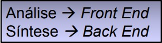
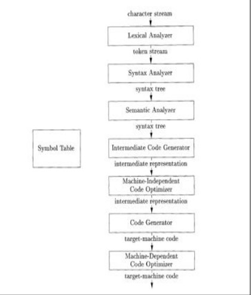
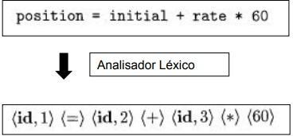
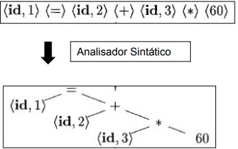
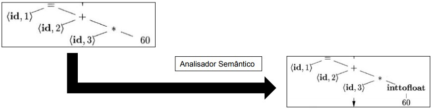
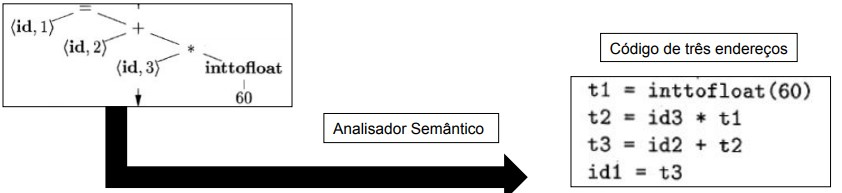
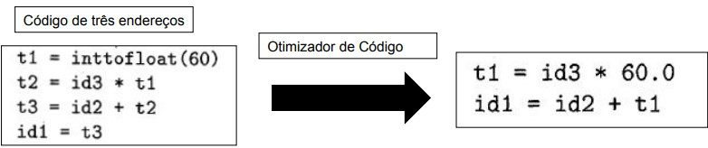
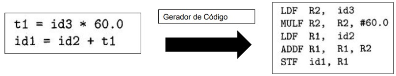

# Introdução
*  Categorias de tradutores:
    * **Compilador**
        *  É uma categoria de tradutor.
    * **Montadores (assemblers)**
        * Traduzem programas codificados em linguagem simbólica (Assembly) para instruções em linguagem de máquina. Normalmente, a relação de instruções é de uma para uma.
    * **Macro-Assemblers**
        * Traduzem instruções macro, codificadas em linguagem simbólica para um conjunto de instruções na mesma linguagem.
    * **Processadores ou filtros**
        * Traduzem instruções codificadas em uma linguagem de alto nível estentida para instruções da linguagem de programação original. Ou seja, a tradução é feita entre duas linguagens de alto nível.
    * **Descompiladores ou desmontadores**
        * Programas que realizam o processo inverso ao normalmente realizado pelos outros tipos de tradutores. A partir do código objeto é obtido o código simbólico.
    * **Interpretadores**
        * Programas que traduzem programas codificados em linguagens de programação de alto nível para um código intermediário, que realiza a execução do algoritmo original, sem traduzi-lo para a linguagem de máquina.
        * Alguns interpretadores analisam um comando fonte cada vez que este deve ser executado, o que consome muito tempo e é raramente utilizado.
        * Geralmente são mais lentos que os compiladores.
        * Implementação é mais simples e facilitam a implementação de construções complexas.

# Estrutura de um tradutor
* **Análise**
    * Divide o programa fonte em partes impondo uma estrutura gramatical nelas.
* **Síntese**
    * Constrói o programa (saída do tradutor) a partir da estrutura intermediária e das informações contidas na tabela de símbolos.

        

    ### O processo de tradução consiste nas seguintes etapas: 
    

    * **Análise léxica**
        * Identifica uma sequencia de caracteres que se constituem em tokes
            * Palavras reservadas, delimitadores, operadores..
        

    * **Análise sintática** 
        * Produz uma estrutura intermediária que representa a estrutura gramatical obtida anteriormente 
            * Saída em estrutura de árvore
        

    * **Análise semântica** 
        * Verifica consistência semântica da linguagem
            * Verificação de tipos
            * coerência
            * Parâmetos, etc..
    
        

    * **Código intermediário**
        * Representação "Machine-Like"
        * Pode ser visto como um programa para uma máquina abstrata
    
         

    * **Otimização de código**
        * Otimiza o código intermediário seguindo algum critério pré-definido.
            * Velocidade de execução
            * Tamanho do programa gerado
            * Consumo de energia
        
        
    
    * **Geração de código
        * Utiliza como entrada o código intermediário e o mapeia para a linguagem alvo.
        * Registradores e endereços de memória são alocados para as variáveis do programa.
             

---
## Escopo de declarações
*   O escopo de uma declaração x é a região do programa onde todas as utilizações de **x** referem-se a declaração.
*   **Escopo estático**
    *   Escopo de uma variável pode ser determinado apenas olhando para o código fonte.
*  **Escopo dinâmico**
    *  Quando programa executa, o mesmo de uso de **x** pode referir-se a diferentes declarações.